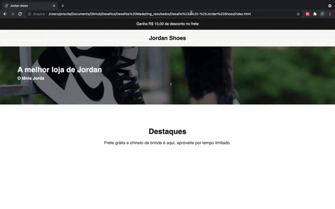
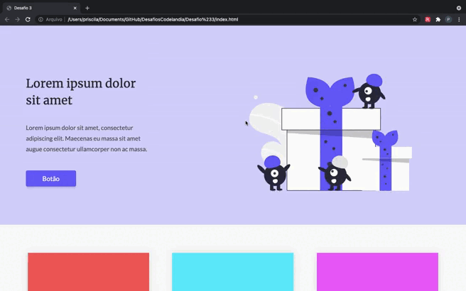
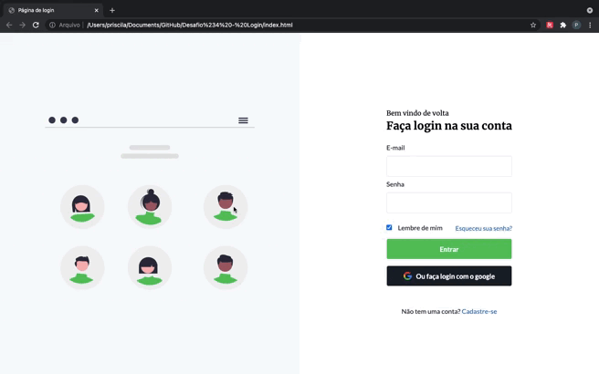

# DesafiosCodelandia
 
Desafio #1 do Codelândia proposto pelo [Iuri Code](https://github.com/iuricode/desafios-codelandia). Um projeto de desafios com intuito de melhorar as suas habilidades fazendo pequenos projetos semanais!

## Sumário

1. [Desafio #1 - Blog](#desafio-1---blog)
2. [Desafio #2 - Jordan Shoes](#desafio-2---jordan-shoes)
3. [Desafio #3 - OnePage](#desafio-3---onepage)
4. [Desafio #4 - Tela de Login](#desafio-4---tela-de-login)
5. [Status do Projeto](#status-do-projeto)
6. [Autora](#autora)
7. [Contato](#contato)

## Desafio #1 - Blog

- Desenvolver um mini-blog com layout responsivo e animação. 

## Tecnologias utilizadas

- Html
- CSS
- JavaScript 

Bibliotecas Utilizadas

- [ScrollReveal](https://scrollrevealjs.org/guide/customization.html)

### Resultado - Desafio 1

## Desafio #2 - Jordan Shoes

- Desenvolver o site de uma loja de tênis Jordan com layout responsivo e animação. 

## Tecnologias utilizadas

- Html
- CSS
- JavaScript 

Bibliotecas Utilizadas

- [ScrollReveal](https://scrollrevealjs.org/guide/customization.html)
- [TypedJS](https://mattboldt.com/demos/typed-js/)

### Resultado - Desafio 2

## Desafio #3 - OnePage

- Desenvolver uma Landpage

## Tecnologias utilizadas

- Html
- CSS

### Resultado - Desafio 3

## Desafio #4 - Tela de Login

- Desenvolver uma tela de login responsiva

## Tecnologias utilizadas

- Html
- CSS

### Resultado - Desafio 4

## Status do Projeto

O projeto está atualmente em andamento. 

## Autora

Feito com 🧡 por Priscila Zeferino.

## Contato

Linkedin: Priscila Zeferino
E-mail: priscila.zeferino23@gmail.com
